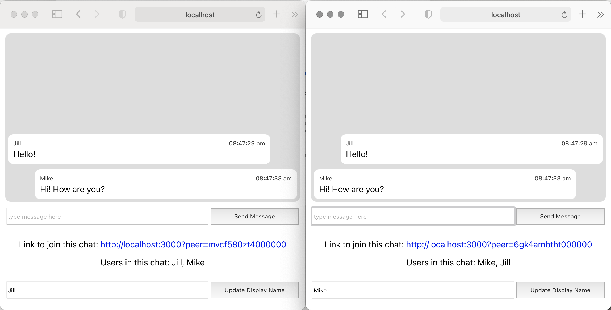

# Simple Chat
A simple peer-to-peer chat app by [Sienna M. Wood](https://siennamwood.com/).

## Getting Started
1. Requirements:
    - [node](https://nodejs.dev/) 10.24.0 or later (includes [npm](https://www.npmjs.com/get-npm))
    - [yarn](https://yarnpkg.com/)
        ```shell script
          # install yarn globally
          npm install -g yarn
        ```     
1. Install and run:
    ```shell script
    # clone repository
    git clone https://github.com/siennamw/simple-chat.git
    cd simple-chat

    # install dependencies
    yarn

    # start development server
    yarn start
    ```
1. Open [http://localhost:3000](http://localhost:3000) in a browser to view the running app. A peer-to-peer session will be created automatically for this user, making it ready for additional users to join.
1. Click the link to join the chat and a second tab will open.  The two will be automatically connected in a peer-to-peer session. Additional users can join the session in the same way.
1. Switch between the tabs to send chat messages between them.



## Test
To run all tests once:
```
yarn test --watchAll=false
```
